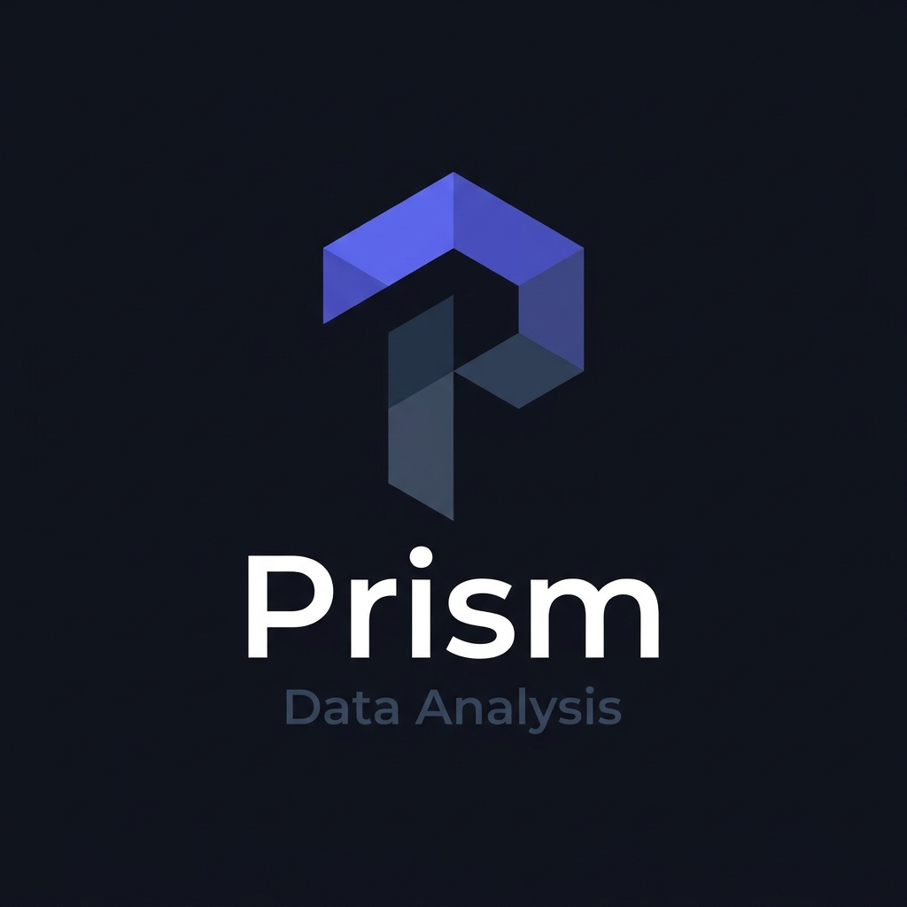

<div align="center">



# Prism

### AI 금융 투자 분석 플랫폼

**어떤 투자 데이터든 업로드하면, 직군에 맞는 Bloomberg급 분석 대시보드를 즉시 제공합니다**

<br />

[](https://prism-izks.vercel.app)

<br />


</div>

---

## 💬 왜 Prism인가요?

> **Bloomberg Terminal은 월 300만원, 기관 전용입니다.**
>
> "다양한 직군에 종사하시는 많은 분들에게 정보를 제공하는 하냐의 툴이 있으면 좋지 않을까?" 라는 생각에 만들었습니다.
> CSV 파일 하나로 동일한 수준의 분석을 — 무료로.

---

## ✨ 주요 기능

<table>
<tr>
<td width="50%">

**📊 4개 직군별 맞춤 대시보드**
- Stock Investor — 수급·공매도·RSI·PE 감지
- Fund Manager — 샤프·칼마·컴플라이언스
- Accountant — Z-Score·부도 조기경보·DSO
- Analyst — PER·PBR·EPS·밸류에이션

</td>
<td width="50%">

**🤖 AI 3중 활용**
- 파일 업로드 시 컬럼명 자동 매핑
- Skills.md 기반 직군 맞춤 인사이트
- DART 최근 공시 호재/악재 자동 분류

</td>
</tr>
<tr>
<td width="50%">

**📁 모든 파일 형식 지원**
- CSV · Excel · JSON · PDF
- 한글/영문 혼용 컬럼명 자동 처리
- 비상장사 포함 DART 자동 보완

</td>
<td width="50%">

**📄 PDF 리포트 내보내기**
- 직군별 맞춤 리포트 구성
- AI Executive Summary 포함
- 재무제표·공시·밸류에이션 전체 수록

</td>
</tr>
</table>

---

## 🧠 Skills.md — Prism의 두뇌

Skills.md는 **분석 기준과 인사이트 생성 규칙을 정의한 범용 MD 문서**입니다.
코드를 수정하지 않아도 Skills.md만 바꾸면 시스템 전체가 업데이트됩니다.

```
입력 (제각각인 파일)          출력 (표준화된 대시보드)
─────────────────────    →    ────────────────────────
날짜 / Date / 기준일           date
종가 / Close / 현재가          close
Net Sales(억) / 매출액         revenue (× 억 단위 변환)
Operating Profit               operating_income (AI 자동 매핑)
```

> **"컬럼명이 '종가'든 'Close'든 '현재가'든 — Skills.md가 자동으로 통역합니다"**

---

## 🎬 데모 시나리오 — 홈플러스 부도 조기경보

> *"2025년 홈플러스 부도, Prism으로 미리 알 수 있었을까요?"*

| 지표 | 값 | 상태 |
|------|-----|------|
| 유동비율 | 4.8% | 🔴 100% 미만 |
| 이자보상배율 | -0.59배 | 🔴 이자 미충당 |
| 부채비율 | -274.2% | 🔴 완전 자본잠식 |
| 알트만 Z-Score | 위험 구간 | 🔴 부도 위험 |
| AI 인사이트 | — | **"매도를 권고합니다"** |

**→ `homeplus_financial.csv` 파일 하나로, 부도 1년 전에 이미 경보가 떴을 겁니다.**

---

## 🏗️ 아키텍처

```
사용자
  ├─ 종목코드/회사명 입력 ──→ KRX 실시간 데이터 (pykrx)
  └─ 파일 업로드 (.csv/.xlsx/.json/.pdf)
                │
                ▼
       [Frontend] Vercel
       React + TypeScript + Tailwind CSS
                │  REST API
                ▼
       [Backend] Railway
       FastAPI + Python 3.9
         ├─ 파일 파싱 + AI 컬럼 매핑     (Claude API)
         ├─ 금융 지표 계산               (pandas / numpy)
         ├─ KRX 실시간 데이터 수집       (pykrx)
         ├─ DART 공시 · 재무제표 수집    (dart-fss + DART OpenAPI)
         └─ AI 인사이트 생성             (Claude Sonnet)
                │
                ▼
       [Database] Supabase
       로그인 · 조회 히스토리 저장
```

---

## 📁 프로젝트 구조

<details>
<summary>Frontend</summary>

```
frontend/src/
├── pages/
│   ├── Landing.tsx          # 직군 선택 홈화면
│   └── Dashboard.tsx        # 메인 대시보드
├── components/
│   ├── dashboards/
│   │   ├── StockDashboard.tsx
│   │   ├── FundDashboard.tsx
│   │   ├── FinancialDashboard.tsx
│   │   └── AnalystDashboard.tsx
│   ├── charts/
│   │   ├── StockChart.tsx        # 캔들스틱 차트
│   │   ├── InvestorChart.tsx     # 수급 차트
│   │   └── CreditRiskChart.tsx   # 신용위험 바 차트
│   └── common/
│       ├── AuthModal.tsx         # 로그인/회원가입
│       ├── HistoryPanel.tsx      # 조회 히스토리
│       ├── InsightBox.tsx        # AI 인사이트
│       ├── DartInsight.tsx       # DART 공시 요약
│       ├── RiskScore.tsx         # 위험 점수 게이지
│       └── KpiCard.tsx           # 지표 카드
└── lib/
    └── supabase.ts               # 인증 + 히스토리 저장
```

</details>

<details>
<summary>Backend</summary>

```
backend/app/
├── routers/
│   ├── upload.py       # POST /upload/
│   ├── analyze.py      # POST /analyze/
│   ├── stock.py        # GET  /stock/search, ohlcv, investor
│   ├── dart.py         # GET  /dart/insight, /dart/full
│   └── insight.py      # POST /insight/
└── services/
    ├── parser.py           # CSV/Excel/JSON 파싱
    ├── pdf_parser.py        # PDF 파싱 (Claude API)
    ├── ai_mapper.py         # 컬럼명 자동 매핑
    ├── normalizer.py        # 데이터 정규화
    ├── validator.py         # 데이터 유효성 검사
    ├── calculator.py        # 금융 지표 계산 (핵심)
    ├── collector.py         # KRX 실시간 데이터
    ├── corp_cache.py        # 종목명↔코드 캐시
    ├── dart_insight.py      # DART 전체 데이터 수집
    └── insight_engine.py    # AI 인사이트 생성
```

</details>

---

## 🛠️ 기술 스택

| 구분 | 기술 |
|------|------|
| **Frontend** | React 18, TypeScript, Tailwind CSS, ApexCharts |
| **Backend** | FastAPI, Python 3.9, pandas, numpy |
| **AI** | Anthropic Claude Sonnet (컬럼 매핑 · 공시 요약 · 인사이트) |
| **데이터** | pykrx (KRX), dart-fss + DART OpenAPI |
| **인증/DB** | Supabase (Auth + PostgreSQL) |
| **배포** | Vercel (Frontend), Railway (Backend) |

---

## 🔑 환경변수 설정

**Frontend `.env`**
```bash
VITE_SUPABASE_URL=https://your-project.supabase.co
VITE_SUPABASE_ANON_KEY=your-anon-key
```

**Backend `.env`**
```bash
ANTHROPIC_API_KEY=sk-ant-...
DART_API_KEY=your-dart-key
```

---

## ✅ 구현 현황

| 기능 | 상태 |
|------|------|
| 4개 직군 대시보드 | ✅ |
| 종목명/코드 양방향 검색 | ✅ |
| 자동완성 드롭다운 | ✅ |
| DART 6종 데이터 병렬 수집 | ✅ |
| 파일 업로드 (CSV/Excel/JSON/PDF) | ✅ |
| AI 컬럼 자동 매핑 | ✅ |
| DART 자동 보완 (비상장사 포함) | ✅ |
| 알트만 Z-Score 부도 조기경보 | ✅ |
| Claude AI 인사이트 | ✅ |
| DART 공시 AI 요약 | ✅ |
| PDF 리포트 내보내기 | ✅ |
| 로그인 + 조회 히스토리 저장 | ✅ |
| 반응형 (모바일 대응) | ✅ |

---

## 📅 개발 기간

**2026년 4월 29일 ~ 5월 9일 (11일)**

---

<div align="center">

**Prism v0.1 · 2026**

*현직 금융권 종사자가 직접 만든 투자 분석 플랫폼*

</div>
